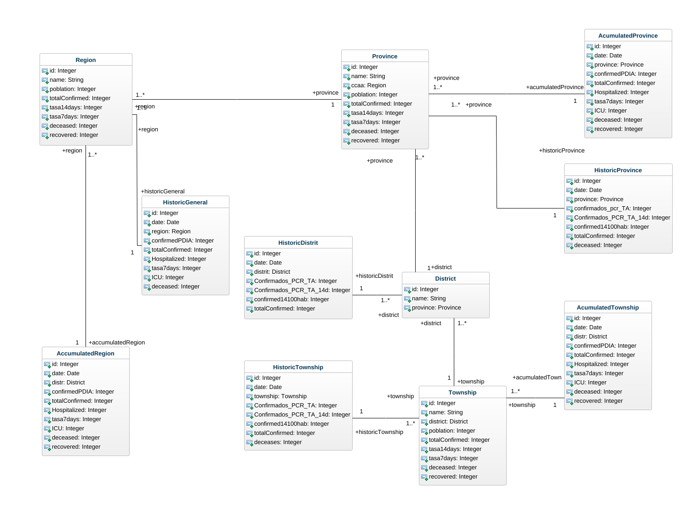

# Andalucía COVID Dashboard


## Índice

- [1. Introducción](#introduccion)

- [2. Objetivos](#objetivos)

- [3. Tecnologías escogidas y justificación](#tecnologías)

- [3.1. Frameworks seleccionados](#framework)

- [3.2. Motor de bases de datos](#bbdd)

- [3.3. Librerías](#librerias)

- [4. Instalación en docker](#instalacion_docker)

- [6. Fuentes](#fuentes)

- [7. Work in Progress](#WIP)

# :sparkles: Introducción

<a  name="introduccion"></a>

Aplicación web realizada para el trabajo de fin de ciclo de Desarrollo de Aplicaciones Web sobre la evolución del COVID en Andalucía. El diagrama de clases utilizado es el siguiente:




# :checkered_flag: Objetivos

<a  name="objetivos"></a>

El objetivo es desarrollar una aplicación web donde se puedan consultar los datos epidemiológicos de la pandemia del SARS-CoV19 en Andalucía para consultar la situación de cada territorio y/o consultar el estado de la pandemia.

## :computer: Tecnologías utilizadas y justificación

<a  name="tecnologías"></a>

La aplicación se desarrolla en su mayor parte usando lenguaje `python` :snake:

## Framework

<a  name="framework"></a>

El framework escogido es `Django framework` por diversas razones:

Los motivos principales para usar Django son:

- [x] Es muy rápido: Si tenéis una startup, tenéis prisa por terminar vuestro proyecto o, simplemente, queréis reducir costes, con Django se puede construir una aplicación muy buena en poco tiempo.

- [x] Viene bien cargado de funcionalidades: Cualquier cosa que se necesite realizar, ya estará implementada, sólo hay que adaptarla a las necesidades del proyecto.

- [x] Es seguro: Implementa por defecto algunas medidas de seguridad, las más clásicas, para que no haya SQL Injection, no haya Cross site request forgery (CSRF) o no haya Clickjacking por JavaScript. Django se encarga de manejar todo esto de una manera realmente sencilla.

- [x] Es muy escalable: Podemos pasar desde muy poco a una aplicación enorme perfectamente, una aplicación que sea modular, que funcione rápido y sea estable.

- [x] Es increíblemente versátil: Se puede utilizar para aplicaciones multipropósito.

- [x] Tiene una documentación muy completa y una gran comunidad muy colaborativa.

## Motor de base de datos

<a  name="bbdd"></a>

El motor de base de datos elegido es PostgreSQL:

- [x] Instalación ilimitada y gratuita

- [x] Es multiplataforma para Windows, Linux y Mac (los sistemas operativos más extendidos) con lo cual se podrá disponer él en cualquiera de estos.

- [x] Es un motor con un uso muy extendido en la comunidad de desarrolladores, con lo que conseguir ayuda es muy sencillo.

- [x] Potencia y Robustez

- [x] Es escalable, lo cual nos da una ventaja con vistas al futuro.

## :book: Librerías

<a  name="librerias"></a>

- [x] `[Twitter Bootstrap]` - Bootstrap es una biblioteca multiplataforma o conjunto de herramientas de código abierto para diseño de sitios y aplicaciones web

- [x] `[Pandas]` - Es una librería de Python especializada en el manejo y análisis de estructuras de datos.

- [x] `[Charts.js]` - Chart.js es una biblioteca JavaScript gratuita de código abierto para la visualización de datos, que admite 8 tipos de gráficos: barra línea área circular burbuja radar polar dispersión

- [x] `[jQuery]` - jQuery es una biblioteca multiplataforma de JavaScript, creada inicialmente por John Resig, que permite simplificar la manera de interactuar con los documentos HTML.

## :whale: Instrucciones para instalar el proyecto

<a  name="instalacion_docker"></a>

Una vez clonado el proyecto nos posicionamos en la raíz del repositorio y desplegamos los contenedores:

```
docker-compose up -d --build
```

## Hacer las migraciones necesarias

Una vez el proceso anterior haya finalizamos hacemos las operaciones pertinentes para recopilar archivos estáticos de cada una de sus aplicaciones (y cualquier otro lugar que especifique) en una única ubicación que se pueda servir fácilmente en producción.

```
# Recopilar ficheros estáticos
docker-compose exec web python3 manage.py collectstatic
# Añadimos los territorios de Andalucía
docker-compose exec web python3 manage.py set_territories
# Añadimos los históricos
docker-compose exec web python3 manage.py get_historic
# Añadimos los acumulados de provincias
docker-compose exec web python3 manage.py get_acumulated --territorio -pro
# Añadimos los acumulados de toda la región
docker-compose exec web python3 manage.py get_acumulated --territorio -all
```

Tras la primera migración no hará falta volver a ejecutar los comandos, ya que el docker-compose trae un fichero cron_job donde están dichos comandos configurados para su ejecución periódica y que la aplicación actualice los datos del SarsCOv2 en Andalucía.

```
0 14,18 * * * python3 manage.py set_territories
0 14,18 * * * python3 manage.py get_acumulated --territorio all
0 14,18 * * * python3 manage.py get_acumulated --territorio pro
0 14,18 * * * python3 manage.py
# EOF
```

Este cron_job ejecuta dichos comandos todos los días a las 14:00 y a las 18:00 de la tarde, teniendo en cuenta que los datos de la Junta de Andalucía se actualizan sobre las 12:30 - 13:30 de la tarde y teniendo en cuenta atrasos o problemas informáticos del organismo correspondiente.

Ir a `http://localhost:1337/app/general/`

También es posible utilizar el script `[despliegue.sh]` para hacer el despliegue automático una vez creados los contenedores.

## :chart_with_upwards_trend: Fuentes de los datos

<a  name="fuentes"></a>

Los datos recogidos en esta aplicación web son de uso público y de fuentes oficiales.

- Datos de @Pakillo19 - https://github.com/Pakillo/COVID19-Andalucia/blob/master/datos/

- IECA - https://www.juntadeandalucia.es/institutodeestadisticaycartografia/salud/

## :pencil: WIP

<a  name="wip"></a>

- [x] Añadir modo oscuro

- [x] Corregir diseño responsive

- [x] Añadir propuestas de mejoras de diseño

- [x] Añadir tarea cron para actualización automática

- [x] Añadir animaciones, transiciones e iconos

## License

[MIT](https://choosealicense.com/licenses/mit/)
